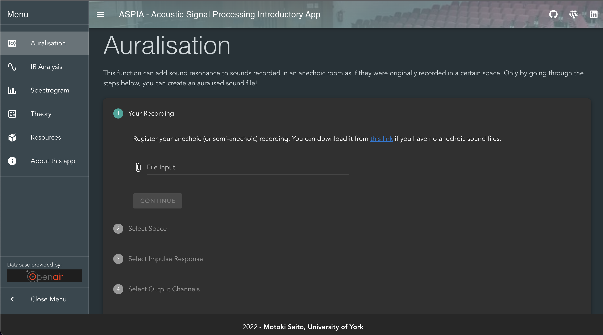
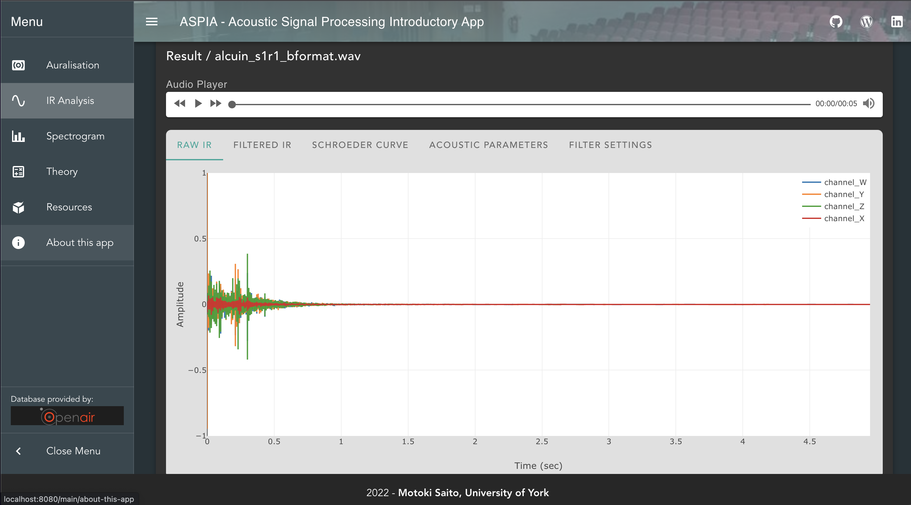
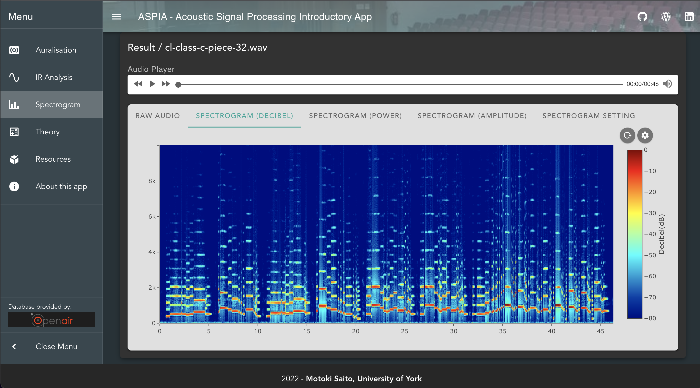

# ASPIA - Acoustic Signal Processing Introductory Application
This application is a part of the MSc project, developed by Motoki Saito, a student of MSc in Audio and Music Technology at University of York.

## Composition
- Frontend framework: Vue 2
- Backend framework: DUCTS (original framework developed by [ifLab Inc](https://www.iflab.co.jp/).)
- Storage: Redis
- Virtualisation tool: Docker

## What it does

- Allows you to execute acoustic signal processing functions using the [OpenAIR](https://www.openairlib.net/) database without troublesome coding processes.
- Lets you learn the mathematical approaches of acoustic signal processing.

## Demo

- You can see a demo video from [this YouTube link](https://www.youtube.com/watch?v=TJ1AxS2TgUM&t=11s).

## What it looks like





## Database

- Database available at [Google Drive](https://drive.google.com/drive/folders/1WnkeMDKhcHAvowOT6f4N4Q2OtaYNGiWu?usp=sharing).
- Place `impulse_response` folder at `/backend/` directory.
- Place the rest of the folders at `/frontend/src/assets/` directory.

## Build & Run

0. Install [Docker](https://docs.docker.com/get-docker/) and [Docker Compose](https://docs.docker.com/compose/install/)

1. Clone this repository

2. Open `.env` and edit as needed.

3. Build.

```
sudo docker-compose build
```

4. Run.

```
sudo docker-compose up
```
